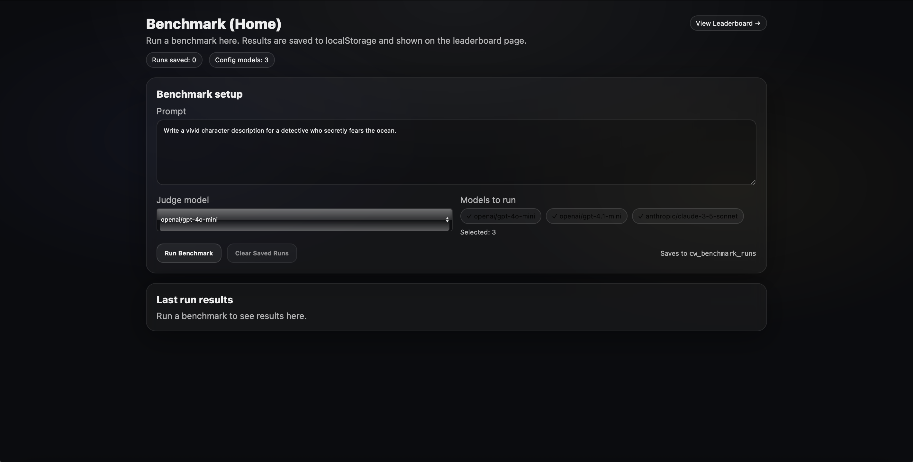
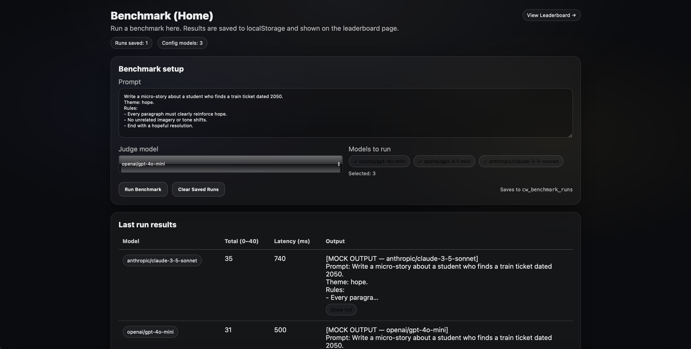
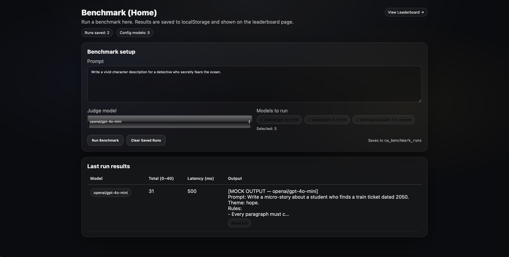

# Creative-Writing-LLM-Benchmark

A **Next.js-based benchmarking platform** for comparing large language models on **creative writing quality**.

This project implements an **LLM-as-a-judge evaluation pipeline** with **theme coherence scoring**, persistent run history, interactive leaderboards, and visual analytics.

---

## Features

- Compare multiple LLMs on creative writing prompts  
- LLM-as-a-judge evaluation pipeline  
- Theme coherence scoring (**0–10 scale**)  
- Persistent run history  
- Interactive charts and leaderboards  
- LiteLLM integration for model routing  
- Clean, reproducible benchmarking UI  

---

## Project Structure

```text
app/                 Next.js app router
components/          Reusable visualization components
lib/                 Benchmarking and scoring logic
docs/screenshots/    README screenshots
litellm-config.yaml  LiteLLM routing config
docker-compose.yml   Optional container setup
```

---

## How to Run (Local)
- Install dependencies:
  npm install
- Create env file:
  cp .env.local.example .env.local
- Start dev server:
  npm run dev
- Open browser:
  http://localhost:3000

---

## How to Run with LiteLLM
- Install LiteLLM:
  pip install litellm
- Start LiteLLM proxy:
  litellm --config litellm-config.yaml --port 4000
- Update .env.local:
  LITELLM_BASE_URL=http://localhost:4000
- Run the app:
  npm run dev

---

## Architecture Overview

```text
  User Prompt
   ↓
  /api/benchmark
   ↓
  LLM Outputs (via LiteLLM)
   ↓
  Judge Model (LLM-as-a-Judge)
   ↓
  Theme Coherence Score (0–10)
   ↓
  Persistent Run History
   ↓
  Leaderboard + Visual Analytics
```
---

## Project Structure

```text
app/
 ├─ api/
 │   ├─ benchmark/
 │   ├─ config-models/
 │   └─ model-metadata/
 ├─ leaderboard/
 └─ page.tsx

components/
 ├─ LeaderboardChartCard.tsx
 ├─ ThemeCoherenceLineChart.tsx
 └─ AnimatedBar.tsx

lib/
 ├─ bench.ts
 ├─ judge.ts
 ├─ leaderboardStore.ts
 ├─ modelColors.ts
 └─ storage.ts

docs/
 └─ screenshots/

litellm-config.yaml
```

##Screenshots

### UI Overview


### Model Comparison with Scores


### Single Model Run


### Top Models per Task


### Theme Coherence Over Runs


